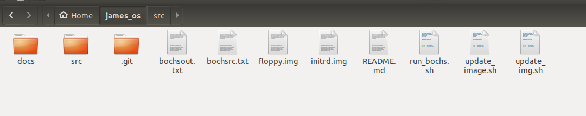
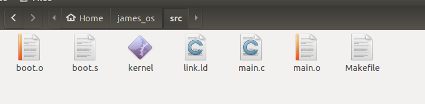
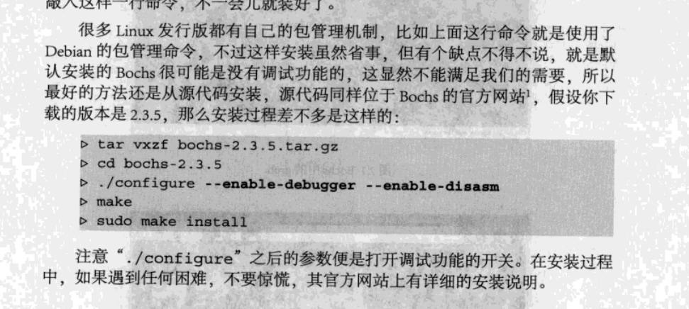
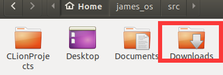
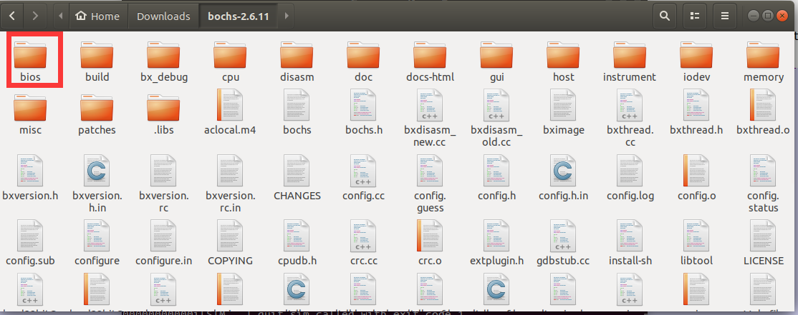

# 1. Environment setup

👉首先你要有一个linux系统，可以是虚拟机，有一个就行

## 1.1 Directory structure

你的文件夹结构应该如下

```
tutorial
 	|
 	+-- src
 	|
 	+-- docs
```





*不要管我现在里面有什么文件，先把结构弄好就行*

## 1.2 Compiling(编译)

需要的工具：gcc、nasm

>  本教程中的示例应使用GNU工具链（gcc，ld，gas等）成功编译。汇编示例以intel语法编写，根据我个人的观点，它比GNU AS使用的AT＆T语法更具可读性。要汇编它们，您将需要安装NASM

> 本教程不是自举程序教程。我们将使用GRUB加载内核。为此，我们需要一个预加载了GRUB的软盘映像。有一些教程可以做到这一点，但是，幸运的是，我制作了一个标准图像，可以在这里找到。这放在您的“教程”（或您命名的名称）目录中。

很不幸的是，作者老哥给的教程和资源好像都失效了，我自己做预加载了grub的软盘映像也没做出来，不过没关系，我们不怕！

[点击进入github](https://github.com/dhyey35/james-molloy-os)

我们直接下载他的floppy.img文件就可！

## 1.3 Running (运行)

> Bochs is an open-source x86-64 emulator. When things go completely awry, bochs will tell you, and store the processor state in a logfile, which is extremely useful. Also it can be run and rebooted much faster than a real machine. My examples will be made to run well on bochs.

> Bochs是一个开源x86-64仿真器。当事情完全出错时，bochs会告诉您，并将处理器状态存储在日志文件中，这非常有用。而且它的运行和重新启动速度都比真实计算机快得多。我的示例将在boch上很好地运行。

我们使用Bochs运行项目



--来源《orange S:一个操作系统的实现 》

[-->Bochs官网](http://bochs.sourceforge.net/)

## 1.4 Bochs

>In order to run bochs, you are going to need a bochs configuration file (bochsrc.txt). Coincidentally, a sample one is included below!

> 想要运行bochs，你需要自己写一个配置文件（bochsrc.txt），下面有示例

>  Take care with the locations of the bios files. These seem to change between installations, and if you made bochs from source it is very likely you don't even have them. Google their filenames, you can get them from the official bochs site among others.

> 注意bios文件的位置，它会因为每个人下载的方式不同而产生变化，如果你是用源码安装的话你可能根本就没着写文件，谷歌一下它们的文件名，你可以从官网上获得它们。

原作者的配置文件好像有些过时了，我下载的时候已经是`bochs2.6.11`了


```
#原作者的配置文件
megs: 32
romimage: file=/usr/share/bochs/BIOS-bochs-latest, address=0xf0000
vgaromimage: /usr/share/bochs/VGABIOS-elpin-2.40
floppya: 1_44=/dev/loop0, status=inserted
boot: a
log: bochsout.txt
mouse: enabled=0
clock: sync=realtime
cpu: ips=500000
```


我的配置文件

```txt
# 设置虚拟机内存为32MB
megs: 32

# 设置BIOS镜像
romimage: file=/home/michael/Downloads/bochs-2.6.11/bios/BIOS-bochs-latest 

# 设置VGA BIOS镜像
vgaromimage: file=/home/michael/Downloads/bochs-2.6.11/bios/VGABIOS-lgpl-latest

# 用软盘映像启动
boot: floppy
floppya: image="floppy.img", status=inserted


# 设置日志文件
log: bochsout.txt

# 关闭鼠标
mouse: enabled=0

# 打开键盘
keyboard: type=mf, serial_delay=250

# 设置硬盘
ata0: enabled=1, ioaddr1=0x1f0, ioaddr2=0x3f0, irq=14

```

首先说一下设置BIOS和VGA BIOS

我是用的linux虚拟机，压缩包直接下载到了Downloads里面



当我解压完成后，所需要的那两个文件都在bios文件夹里面



所以这个路径大家自己配置就行了。

而且设置软盘映像，推荐的方法是

```txt
floppya: image="floppy.img", status=inserted
```

## 1.5 Useful scripts (有用的脚本)

> We are going to be doing several things very often - making (compiling and linking) our project, and transferring the resulting kernel binary to our floppy disk image.

> 我们将经常做几件事——制作（编译和链接）我们的项目，并将生成的内核二进制文件传输到我们的软盘映像中。

为了完成以上几个任务，我们需要制作几个脚本。

### 1.5.1 Makefile

这个文件也是放在src文件夹里

```
# 教程上的初始版本，反正会报错，大家可以试试，也许是我错了
# Makefile for JamesM's kernel tutorials.
# The C and C++ rules are already setup by default.
# The only one that needs changing is the assembler
# rule, as we use nasm instead of GNU as.

SOURCES=boot.o

CFLAGS=
LDFLAGS=-Tlink.ld
ASFLAGS=-felf

all: $(SOURCES) link 

clean:
 »  -rm *.o kernel

link:
 »  ld $(LDFLAGS) -o kernel $(SOURCES)

.s.o:
 »  nasm $(ASFLAGS) $<
```


接触过c或者c++的同学应该听说过这个，不过没听说过也没关系，就是一个文件来指定如何编译链接以及指定编译哪些文件。我在网上找到的最接近我所处年代的代码里面，他使用的那个Makefile也是存在问题的（也许是我的电脑有问题😓），总之我经过不断试错、百度、谷歌，弄出了一份这个。

```
# Makefile for JamesM's kernel tutorials.
# The C and C++ rules are already setup by default.
# The only one that needs changing is the assembler 
# rule, as we use nasm instead of GNU as.

SOURCES=boot.o
CFLAGS=-nostdlib -nostdinc -fno-builtin -fno-stack-protector -m32
LDFLAGS=-Tlink.ld
ASFLAGS=-felf32

all: $(SOURCES) link

clean:
	-rm *.o kernel

link:
	ld -m elf_i386 $(LDFLAGS) -o kernel $(SOURCES)

.s.o:
	nasm $(ASFLAGS) $<
```

我要说一下，这里的boot.o是之后我们第一步的时候编译生成的，不要惊慌，先写上，以后我们会经常往这个位置添加文件名的。

### 1.5.2 link.ld

也是放在src文件夹里

```
/* Link.ld -- Linker script for the kernel - ensure everything goes in the */
/*            Correct place.  */
/*            Original file taken from Bran's Kernel Development */
/*            tutorials: http://www.osdever.net/bkerndev/index.php. */

ENTRY(start)
SECTIONS
{
  .text 0x100000 :
  {
    code = .; _code = .; __code = .;
    *(.text)
    . = ALIGN(4096);
  }

  .data :
  {
     data = .; _data = .; __data = .;
     *(.data)
     *(.rodata)
     . = ALIGN(4096);
  }

  .bss :
  {
    bss = .; _bss = .; __bss = .;
    *(.bss)
    . = ALIGN(4096);
  }

  end = .; _end = .; __end = .;
}
```

> 该脚本告诉LD如何设置我们的内核映像。首先，它告诉LD我们二进制文件的开始位置应为符号“开始”。然后，它告诉LD .text节（所有代码都在该节中）首先出现，并且应从0x100000（1MB）开始。 .data（已初始化的静态数据）和.bss（未初始化的静态数据）应该紧随其后，并且每个页面都应对齐（ALIGN（4096））。 Linux GCC还添加了一个额外的数据部分：.rodata。这是只读的初始化数据，例如常量。为简单起见，我们将其与.data节捆绑在一起。

### 1.5.3 update_image.sh

放在你的项目的根目录里

> 一个不错的小脚本，它将您的新内核二进制文件戳入软盘映像文件（假定您已创建目录/ mnt）。注意：您需要在$ PATH中使用/ sbin才能使用losetup。

```
#!/bin/bash

sudo losetup /dev/loop0 floppy.img
sudo mount /dev/loop0 /mnt
sudo cp src/kernel /mnt/kernel
sudo umount /dev/loop0
sudo losetup -d /dev/loop0
```

实话实说，我没看懂他说的是什么意思，我把我的给大家看看

```
sudo losetup /dev/loop10 floppy.img
sudo mount /dev/loop10 /mnt2
sudo cp src/kernel /mnt2/kernel
sudo umount /dev/loop10
sudo losetup -d /dev/loop10
```

你需要退到根目录（注意不是用户目录，没有波浪线~的那种），要使用`cd /`命令退回到根目录。在根目录下创建`mnt2`或者其他文件夹都行，别用`mnt`，它`read only`


### 1.5.4 run_bochs.sh

> This script will setup a loopback device, run bochs on it, then disconnect it.

还是老样子，我们看看作者怎么写的

```
#!/bin/bash

# run_bochs.sh
# mounts the correct loopback device, runs bochs, then unmounts.

sudo /sbin/losetup /dev/loop0 floppy.img
sudo bochs -f bochsrc.txt
sudo /sbin/losetup -d /dev/loop0
```

下面是我写的：

```
sudo losetup /dev/loop10 floppy.img
sudo bochs -f bochsrc.txt
sudo losetup -d /dev/loop10
```

### 1.5.5 最后bb一句

好像要运行这些脚本，要用`bash xx.sh`，而不能用`./xx.sh`，否则会出现`no command`报错。