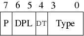

# 4. The GDT and IDT

>The GDT and the IDT are descriptor tables. They are arrays of flags and bit values describing the operation of either the segmentation system (in the case of the GDT), or the interrupt vector table (IDT).

> GDT和IDT是描述符表。它们是标志和位值的数组，描述了分段系统（在GDT的情况下）或中断向量表（IDT）的操作。

> They are, unfortunately, a little theory-heavy, but bear with it because it'll be over soon!

> 不幸的是，它们有点理论上的繁琐，但请耐心等待，因为它很快就会结束！


## 4.1 The Global  Descriptor Table(theroy)

**全局描述表（理论）**

> The x86 architecture has two methods of memory protection and of providing virtual memory - segmentation and paging.

> x86体系结构具有两种保护内存和提供虚拟内存的方法-分段和分页。

> With segmentation, every memory access is evaluated with respect to a segment. That is, the memory address is added to the segment's base address, and checked against the segment's length. You can think of a segment as a window into the address space - The process does not know it's a window, all it sees is a linear address space starting at zero and going up to the segment length.

> 使用分段，将针对分段评估每个内存访问。也就是说，将内存地址添加到段的基地址，并对照段的长度进行检查。您可以将一个段视为进入地址空间的窗口-进程不知道它是一个窗口，所看到的只是一个线性地址空间，从零开始一直到段长度。

> With paging, the address space is split into (usually 4KB, but this can change) blocks, called pages. Each page can be mapped into physical memory - mapped onto what is called a 'frame'. Or, it can be unmapped. Like this you can create virtual memory spaces.

> 使用分页时，地址空间被分为（通常为4KB，但这可以更改）块，称为页面。每个页面都可以映射到物理内存-映射到所谓的“帧”上。或者，可以将其取消映射。这样，您可以创建虚拟内存空间。

> Both of these methods have their advantages, but paging is much better. Segmentation is, although still usable, fast becoming obsolete as a method of memory protection and virtual memory. In fact, the x86-64 architecture requires a flat memory model (one segment with a base of 0 and a limit of 0xFFFFFFFF) for some of it's instructions to operate properly.

> 这两种方法都有其优点，但是分页要好得多。尽管仍然可以使用分段，但作为存储器保护和虚拟存储器的一种方法，分段已迅速过时。实际上，x86-64体系结构需要平面内存模型（一个段的基数为0，限制为0xFFFFFFFF），才能使其某些指令正常运行。

> Segmentation is, however, totally in-built into the x86 architecture. It's impossible to get around it. So here we're going to show you how to set up your own Global Descriptor Table - a list of segment descriptors.

> 但是，分段完全内置在x86体系结构中。绕不开它是不可能的。因此，这里我们将向您展示如何设置自己的全局描述符表-段描述符的列表。

> As mentioned before, we're going to try and set up a flat memory model. The segment's window should start at 0x00000000 and extend to 0xFFFFFFFF (the end of memory). However, there is one thing that segmentation can do that paging can't, and that's *set the ring level*.

> 如前所述，我们将尝试建立一个平面内存模型。段的窗口应从0x00000000开始，并扩展到0xFFFFFFFF（内存的末尾）。但是，有一点是分段无法做到分页无法做到的，那就是设置了ring级别。[-->分级保护域](https://zh.wikipedia.org/wiki/%E5%88%86%E7%BA%A7%E4%BF%9D%E6%8A%A4%E5%9F%9F)

在[计算机科学](https://zh.wikipedia.org/wiki/计算机科学)中, **分级保护域**（英语：hierarchical protection domains）,[[1\]](https://zh.wikipedia.org/wiki/分级保护域#cite_note-1)[[2\]](https://zh.wikipedia.org/wiki/分级保护域#cite_note-2)，经常被叫作**保护环**（Protection Rings），又称**环型保护**（Rings Protection）、**CPU环**（CPU Rings），简称Rings。这是一种用来在发生故障时保护数据和功能，提升容错度，避免恶意操作 ，提升[计算机安全](https://zh.wikipedia.org/wiki/计算机安全)的设计方式。这是一种与能力基础安全（capability-based security）完全相反的方式。[[来源请求\]](https://zh.wikipedia.org/wiki/Wikipedia:列明来源)


> A ring is a privilege level - zero being the most privileged, and three being the least. Processes in ring zero are said to be running in kernel-mode, or supervisor-mode, because they can use instructions like sti and cli, something which most processes can't. Normally, rings 1 and 2 are unused. They can, technically, access a greater subset of the supervisor-mode instructions than ring 3 can. Some microkernel architectures use these for running server processes, or drivers.

> 环是特权级别-0是最高特权，而3是最低特权。零环进程被称为以**内核模式**或**主管模式**运行，因为它们可以使用诸如sti和cli之类的指令，而大多数进程却不能。通常，环1和2不使用。从技术上讲，它们可以比环3存取更多的超级用户模式指令子集。一些微内核体系结构使用它们来运行服务器进程或驱动程序。

> A segment descriptor carries inside it a number representing the ring level it applies to. To change ring levels (which we'll do later on), among other things, we need segments that represent both ring 0 and ring 3.

> 段描述符在其内部携带一个数字，该数字表示其适用的环级别。要更改环级别（我们稍后将进行更改），除其他外，我们需要代表环0和环3的分段。

## 4.2. The Global Descriptor Table (practical)

全局描述表（实践）

> OK, that was one humongous chunk of theory, let's get into the nitty gritty of implementing this.

> nitty：细腻
>
> gritty：含沙砾的; 沙砾般的; 有勇气的; 坚定的; 坚毅的; (对消极事物的描述) 逼真的，真实的，活生生的;
>
> 
>
> 好吧，那只是理论上的一个坎，让我们深入了解如何去实现这一点的精髓。

> One thing I forgot to mention is that GRUB sets a GDT up for you. The problem is that you don't know where that GDT is, or what's in it. So you could accidentally overwrite it, then your computer would triple-fault and reset. Not clever.

> 我忘记提及的一件事是GRUB为您设置了GDT。问题是您不知道该GDT在哪里或其中包含什么。因此，您可能会意外重写了它，然后您的计算机将出现三重故障并重启。这样好吗？这样不好。

> In the x86, we have 6 segmentation registers. Each holds an offset into the GDT. They are cs (code segment), ds (data segment), es (extra segment), fs, gs, ss (stack segment). The code segment must reference a descriptor which is set as a 'code segment'. There is a flag for this in the access byte. The rest should all reference a descriptor which is set as a 'data segment'.

> 在x86中，我们有6个分段寄存器。每个都在GDT中保留一个偏移量。它们是cs（代码段），ds（数据段），es（额外段），fs，gs，ss（堆栈段）。代码段必须引用设置为“代码段”的描述符。在访问字节中有一个标志。其余的都应引用被设置为“数据段”的描述符。

### 4.2.1 descriptor_tables.h

在src文件夹下建立`descriptor_tables.h`文件

一个GDT的描述符（GDT类似于一个数组，里面有很多的GDT单元，我们称之为描述符（Discriptor））可能为如下这样：

```c
// location: /src/descriptor_tables.h
// This structure contains the value of one GDT entry.
// We use the attribute 'packed' to tell GCC not to change
// any of the alignment in the structure.
struct gdt_entry_struct
{
   u16int limit_low;           // The lower 16 bits of the limit.
   u16int base_low;            // The lower 16 bits of the base.
   u8int  base_middle;         // The next 8 bits of the base.
   u8int  access;              // Access flags, determine what ring this segment can be used in.
   u8int  granularity;
   u8int  base_high;           // The last 8 bits of the base.
} __attribute__((packed));
typedef struct gdt_entry_struct gdt_entry_t;
```

> Most of those fields should be self-explanatory. The format of the access byte is given on the right above, and the format of the granularity byte is here on the right.

> 这些属性中的大多数应该是不言自明的。access字节以及granularity（粒度）字节的格式在下面给出（跟原文的位置不太一样，大家凑合着看）
>
> access：
>
> 
>
> granularity:
>
> 
>
> **P:** 是否存在，所有有效的GDT都应该为1
>
> **DPL:**  Discriptor Privilege Level 描述符的特权级别，也就是环级，从ring0到ring3
>
> **DT:** Discriptor Type 描述符的类型
>
> **Type**: 段类型——比如代码段、数据段
>
> **G**：Granulirity 粒度，0-->1byte，1-->1Kbyte
>
> **0**： 永远是0
>
> **A**: 是否对系统可用（永远是0）

> To tell the processor where to find our GDT, we have to give it the address of a special pointer structure:

> 为了告诉处理器在哪里可以找到我们的GDT，我们必须为其指定特殊指针结构的地址：

```c
struct gdt_ptr_struct
{
   u16int limit;               // The upper 16 bits of all selector limits.
   u32int base;                // The address of the first gdt_entry_t struct.
}
 __attribute__((packed));
typedef struct gdt_ptr_struct gdt_ptr_t;
```

> The base is the address of the first entry in our GDT, the limit being the size of the table minus one (the last valid address in the table).

> 基数(base)是GDT中第一个条目的地址，限制(limit)是表的大小减去1（即表中的最后一个有效地址）。

> Those struct definitions should go in a header file, descriptor_tables.h, along with a prototype.

> 这些结构定义应与原型一起放在头文件descriptor_tables.h中。

```c
//location: descriptor_table.h
// Initialisation function is publicly accessible.
void init_descriptor_tables();
```

### 4.2.2 descriptor_tables.c

> In descriptor_tables.c, we have a few declarations:

> 在descriptor_tables.c中，我们有一些声明：

```c
//
// descriptor_tables.c - Initialises the GDT and IDT, and defines the
// default ISR and IRQ handler.
// Based on code from Bran's kernel development tutorials.
// Rewritten for JamesM's kernel development tutorials.
//

#include "common.h"
#include "descriptor_tables.h"

// Lets us access our ASM functions from our C code.
extern void gdt_flush(u32int);

// Internal function prototypes.
static void init_gdt();
static void gdt_set_gate(s32int,u32int,u32int,u8int,u8int);

gdt_entry_t gdt_entries[5];
gdt_ptr_t   gdt_ptr;
idt_entry_t idt_entries[256];
idt_ptr_t   idt_ptr;
```

> Notice the gdt_flush function - this will be defined in an ASM file, and will load our GDT pointer for us.

> 注意gdt_flush函数-这将在ASM文件中定义，并将为我们加载GDT指针。

```c
// location: descriptor_tables.c
// Initialisation routine - zeroes all the interrupt service routines,
// initialises the GDT and IDT.
void init_descriptor_tables()
{
   // Initialise the global descriptor table.
   init_gdt();
}

static void init_gdt()
{
   gdt_ptr.limit = (sizeof(gdt_entry_t) * 5) - 1;
   gdt_ptr.base  = (u32int)&gdt_entries;

   gdt_set_gate(0, 0, 0, 0, 0);                // Null segment
   gdt_set_gate(1, 0, 0xFFFFFFFF, 0x9A, 0xCF); // Code segment
   gdt_set_gate(2, 0, 0xFFFFFFFF, 0x92, 0xCF); // Data segment
   gdt_set_gate(3, 0, 0xFFFFFFFF, 0xFA, 0xCF); // User mode code segment
   gdt_set_gate(4, 0, 0xFFFFFFFF, 0xF2, 0xCF); // User mode data segment

   gdt_flush((u32int)&gdt_ptr);
}

// Set the value of one GDT entry.
static void gdt_set_gate(s32int num, u32int base, u32int limit, u8int access, u8int gran)
{
   gdt_entries[num].base_low    = (base & 0xFFFF);
   gdt_entries[num].base_middle = (base >> 16) & 0xFF;
   gdt_entries[num].base_high   = (base >> 24) & 0xFF;

   gdt_entries[num].limit_low   = (limit & 0xFFFF);
   gdt_entries[num].granularity = (limit >> 16) & 0x0F;

   gdt_entries[num].granularity |= gran & 0xF0;
   gdt_entries[num].access      = access;
}
```

> Lets just analyse that code for a moment. init_gdt initially sets up the gdt pointer structure - the limit is the size of each gdt entry * 5 - we have 5 entries. Why 5? well, we have a code and data segment descriptor for the kernel, code and data segment descriptors for user mode, and a null entry. This *must* be present, or bad things will happen.

> 让我们暂时分析一下该代码。 init_gdt最初设置了gdt指针结构——限制(limit)是每个gdt entry的大小×5——因为我们有5个entry。那么为什么是5？好了，我们有用于内核的代码段描述符和数据段描述符，用于用户模式的代码段描述符和数据段描述符，以及一个空描述符。这必须存在，否则会出错的。

> gdt_init then sets up the 5 descriptors, by calling gdt_set_gate. gdt_set_gate just does some <font color = red>**severe**</font> **bit-twiddling** and shifting, and should be self-explanatory with a **hard stare** at it. Notice that the only thing that changes between the 4 segment descriptors is the access byte - 0x9A, 0x92, 0xFA, 0xF2. You can see, if you map out the bits and compare them to the format diagram above, the bits that are changing are the type and DPL fields. DPL is the descriptor privilege level - 3 for user code and 0 for kernel code. Type specifies whether the segment is a code segment or a data segment (the processor checks this often, and can be the source of much frustration).

> 然后，gdt_init通过调用gdt_set_gate来设置5个描述符。 gdt_set_gate只是进行了一些f<font color=red>**朴实无华**</font>的**位运算**和移位，仔细看一下应该会觉得很清晰明了的。请注意，在4个段描述符之间唯一改变的是access字节-0x9A，0x92、0xFA，0xF2。您可以看到，如果将这些数字变成二进制序列并与上面的格式图进行比较，则发生更改的位就是**Type字段**和**DPL字段**。 DPL是描述符特权级别-用户代码为3，内核代码为0。Type指定该段是代码段还是数据段（处理器会经常检查该段，这也是造成很多失败的原因）。

我查了查severe的意思，好像只有这个放在语境中才对的上号。如果有不恰当的地方请及时联系我。


还有一个bit-twiddling，当我用浏览器搜索的时候，[Bit Twiddling Hacks](https://graphics.stanford.edu/~seander/bithacks.html)这篇文章映入我眼帘，而且网上对其的翻译一般都是位操作，所以这里我也暂且将bit-twiddling翻译为位操作。

> Finally, we have our ASM function that will write the GDT pointer.
>
> 最后，我们书写ASM函数，它将编写GDT指针